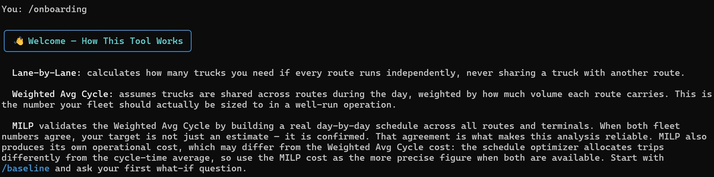
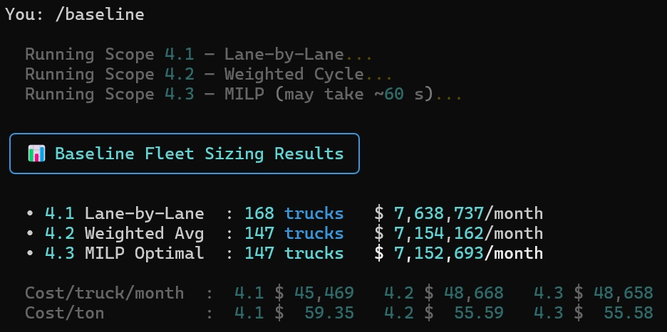

# Logistics Fleet Sizing Planning

A Python CLI tool that calculates the minimum truck fleet required to serve a logistics network, and lets you explore operational scenarios in plain English via a natural language interface. The interface runs in **English** and **Portuguese (Brasil)** — switch at any time with `/language pt_BR` or `/language en`.

---

## The problem it solves

This tool sizes the fleet three ways, from most simpe to most precise, so you can see both the safe upper bound and the tightest defensible target.

---

## How the three methods work

### 4.1 Lane-by-Lane (simple upper bound)
Each collection point → terminal lane is treated as if it runs in complete isolation. 
Total fleet = sum across all lanes. Definitelly very simple calculation.

### 4.2 Weighted Average Cycle (operational target)
A single weighted-average cycle time is computed across all active lanes, weighted by their share of total monthly volume. 

### 4.3 MILP Network Optimisation (precision instrument)
A mixed-integer linear program (HiGHS solver) builds an explicit day-by-day schedule over a 24-day horizon. It introduces two capabilities the static models cannot capture:

- **One-way trips**: a truck delivers CP→Terminal and stays at the terminal overnight, instead of driving back empty. Another truck repositions it the next morning.
- **Cross-CP repositioning**: trucks can move between collection points to balance the fleet across the network.

The objective is to minimise total fleet count `N`, subject to demand satisfaction, capacity limits, time budgets, and cyclical flow conservation. All trip variables are continuous (fractional trips); only `N` is integer. 

**When 4.2 and 4.3 agree**, the weighted-cycle target is not just an estimate — it is confirmed by a real schedule. 

---

## Quick start

```bash
# Install dependencies
pip install -r requirements.txt
pip install anthropic   # required separately for the NL interface

# Set your Anthropic API key
export ANTHROPIC_API_KEY=your_key_here   # Linux/macOS
set ANTHROPIC_API_KEY=your_key_here      # Windows

# Run
python runmodel.py
```

<p align="center">

</p>

<p align="center">

</p>

Results are printed to the console and saved as versioned CSVs in `outputs/`.

---

## Natural language what-if interface

After the baseline runs, you interact with a plain-English prompt. Claude (Haiku) parses your question into structured parameter changes, applies them to a deep copy of the input data, re-runs all three methods, and surfaces the results in a short analyst paragraph.

The pipeline per query:

```
user query → Claude parses → ScenarioChange list → apply_scenario() → 3 methods → comparison table → insight paragraph
```

### What you can ask

**Driver policy**
```
"Add 1 hour of overtime"
"Increase shift hours to 10:30"
"Working days increase to 26 per month"
```

**Truck parameters**
```
"Truck payload increases by 1.5 tons"
"Loaded speed drops 10% due to road works"
"Truck availability falls to 80%"
```

**Cost changes**
```
"Set fuel cost to $3.50/km"
"Maintenance cost increases 12%"
"Depreciation rises to $8,500/truck/month"
"Overtime rate increases to $15/hour"
```

**Terminal & demand**
```
"Terminal A capacity increases to 60,000 tons/month"
"Unload time at Terminal B increases 15%"
"Demand at CP01 and CP07 grows 15%"
```

### Combined queries — 

```
"Set fuel to $3.80/km and relocate the volume"
"Availability drops to 80% — can cargo relocation offset the fleet increase?"
"Set truck availability to 88% then increasing tractor maintenance to 0.33"
```
---

## Slash commands

| Command | Description |
|---|---|
| `/baseline` | Show the baseline fleet sizing results |
| `/whatif` | Show scenario types and example queries |
| `/relocate` | Run standalone demand relocation on the current baseline |
| `/driver` | Show current driver policy, truck parameters, and cost rates |
| `/list` | Show all collection points and terminals with capacities and demand |
| `/operational-costs` | Show the full variable and fixed cost breakdown |
| `/network` | Show network topology sketch and demand heatmap for the current state |
| `/planning-analyst` | Synthesise all saved scenario CSVs into a strategic report |
| `/onboarding` | Explain how the three methods relate to each other |
| `/language` | Show or change the interface language (`/language en` or `/language pt_BR`) |
| `/help` | Show all commands |
| `/clear` | Clear the terminal screen |
| `/quit` | Exit |

### Planning analyst

`/planning-analyst` makes two sequential Claude calls:

1. **Analyst**: reads all scenario CSVs saved in `outputs/` plus a persistent `analyst_memory.md`, and synthesises findings into a structured strategic report (fleet trends, cost drivers, relocation potential, recommendations).
2. **Auditor**: fact-checks every claim in the draft against the raw CSV numbers before the report is shown.

The analyst remembers past sessions via `outputs/analyst_memory.md`. Insights rated 2 or 3 out of 3 are appended as dated entries and injected into future analyst calls.

---

## Network scale limits

The application is fully dynamic — node names and counts are discovered from the Excel files at startup. There are no hardcoded CP or terminal references in the code.

| Dimension | Recommended limit | Notes |
|---|---|---|
| Collection Points | ≤ 30 | CP-to-CP repositioning variables in the MILP grow as n² — 30 CPs is roughly 4× the reference network and stays well within the 5-minute solver budget |
| Unload Terminals | ≤ 5 | Terminals add a linear factor; beyond 5 the total variable count pushes toward the timeout |

Beyond these limits the application still runs — HiGHS returns the best solution found within 300 seconds — but the 1 % optimality gap guarantee may not be met. Scopes 4.1 and 4.2 have no practical scale limit. The startup summary prints a warning when the loaded network exceeds these thresholds.

---

## Project structure

```
logistics-fleet-planning-br/
├── data/                         # Input xlsx files — read-only, never modified by code
├── outputs/                      # Generated CSVs + analyst_memory.md
├── fleet_sizing/
│   ├── data.py                   # load_data() → PreprocessedData (single data contract)
│   ├── results.py                # Typed result dataclasses (Scope41, 42, 43, MILPTrip)
│   ├── scenario.py               # ScenarioChange + apply_scenario() — what-if mutations
│   ├── scope_41.py               # Solver: lane-by-lane
│   ├── scope_42.py               # Solver: weighted average cycle
│   ├── scope_43.py               # Solver: MILP (PuLP + HiGHS)
│   ├── relocate.py               # LP demand relocation optimizer
│   ├── cli.py                    # All Rich terminal UI — display-only, no business logic
│   ├── nl_interface.py           # Interactive REPL, slash command dispatch, Claude API calls
│   ├── report.py                 # Versioned CSV export
│   ├── planning_analyst.py       # Planning analyst + auditor subagent
│   ├── planning_analyst.md       # Analyst system prompt
│   └── planning_analyst_auditor.md  # Auditor system prompt
├── tests/
├── runmodel.py                   # Entry point
└── requirements.txt
```
---

## Stack

| Library | Role |
|---|---|
| `pandas` / `numpy` | Data loading and array operations |
| `pulp` + HiGHS (bundled) | MILP and LP solvers (Scopes 4.3 and relocation) |
| `openpyxl` | Excel input reading |
| `rich` | Terminal UI — tables, panels, colours |
| `prompt_toolkit` | Interactive prompt with tab-completion |
| `anthropic` | Claude API — NL parsing (Haiku) and planning analyst |
| `pytest` | Test suite |

---
